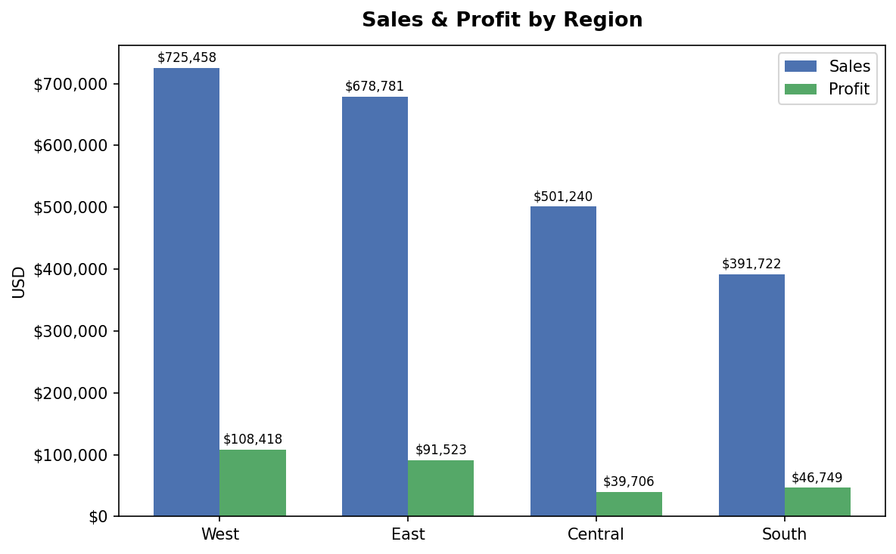
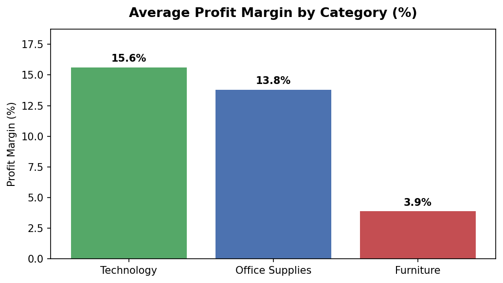
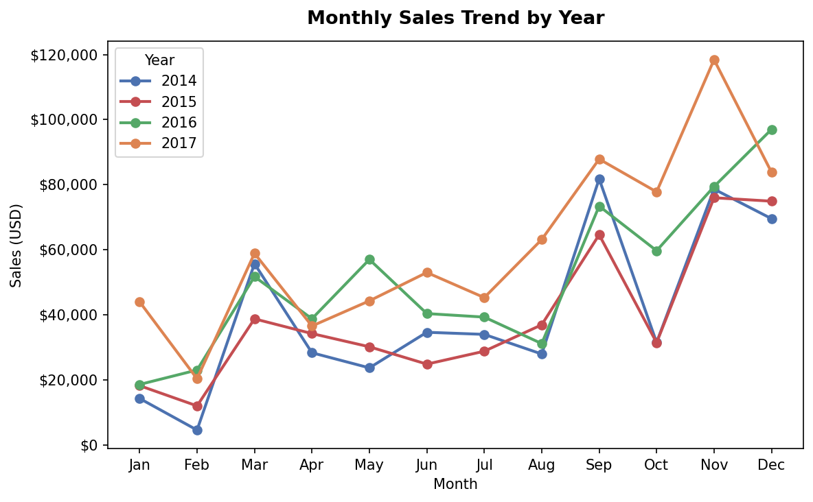
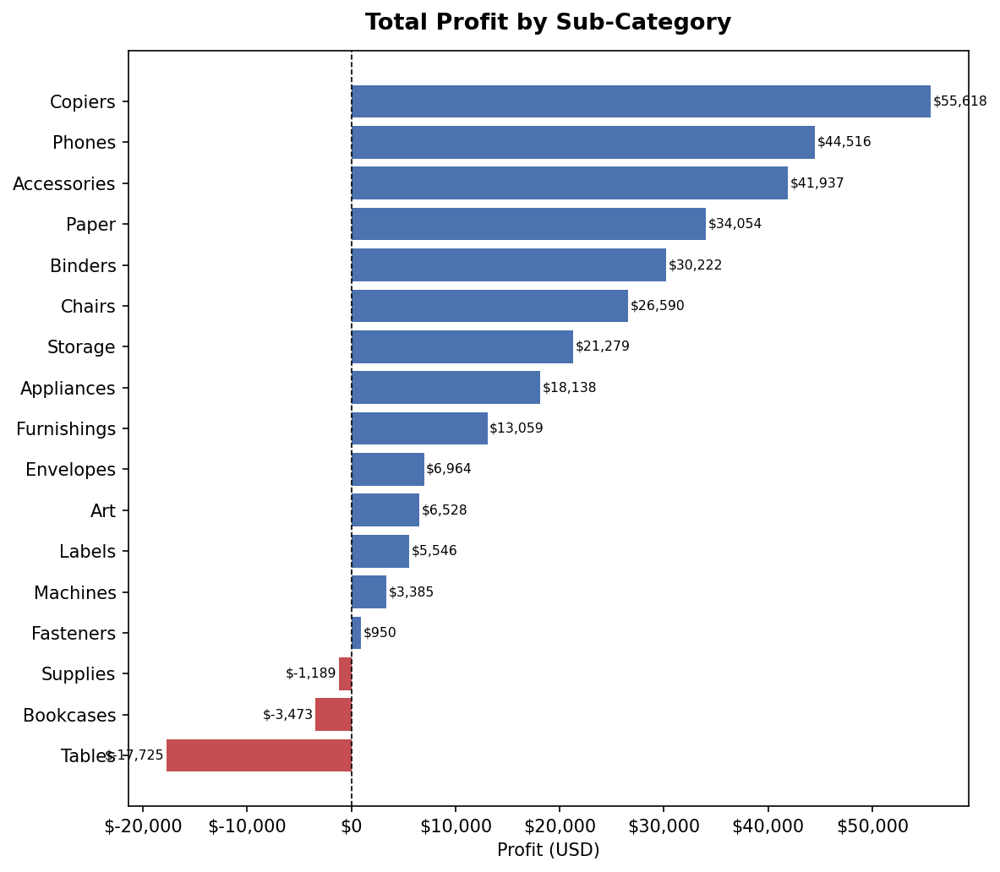
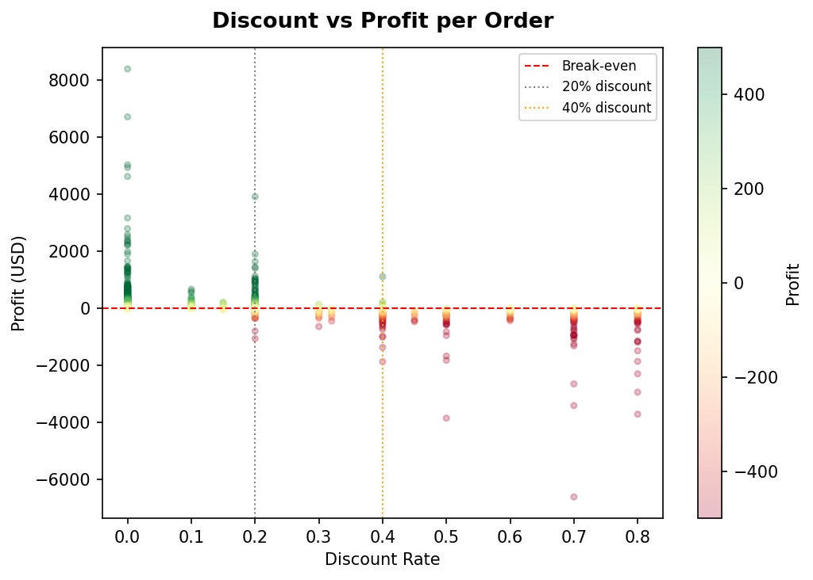
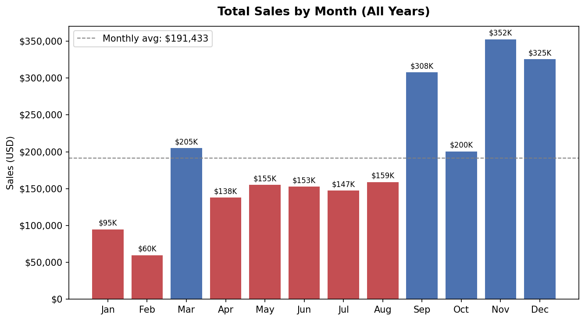

# Superstore Sales Analysis

Exploratory data analysis and business KPI breakdown for a fictional 
US retail company (2014–2017). Built to identify which regions, 
categories, and products drive profit — and which destroy it.

---

## Dataset

- **Source:** [Kaggle — Sample Superstore](https://www.kaggle.com/datasets/vivek468/superstore-dataset-final)
- **Records:** 9,994 orders
- **Period:** January 2014 – December 2017
- **Key columns:** Sales, Profit, Discount, Region, Category, Sub-Category

---

## Key Findings

- **West** leads in total sales ($725K), but high discounting in 
  **Central** drags its profitability down.
- **Technology** is the most profitable category with a 16% average 
  margin. **Furniture** sells $742K but keeps only 4 cents per dollar.
- **Tables (-$17.7K), Bookcases (-$3.5K) and Supplies (-$1.2K)** are 
  the only sub-categories operating at a loss.
- Discounts above 20% consistently produce negative profit. Orders 
  with discounts over 40% average **-$106 in losses per order**.
- Sales peak sharply in **September, November and December** every year, 
  driven by seasonal demand.
- After a -2.8% dip in 2015, the business recovered strongly: 
  **+29.5% in 2016 and +20.4% in 2017**.

---

## Visualizations

### Sales & Profit by Region


### Profit Margin by Category


### Monthly Sales Trend by Year


### Profit by Sub-Category


### Discount vs Profit


### Monthly Seasonality


---

## Tools

| Tool | Purpose |
|---|---|
| Python 3.x | Core language |
| Pandas | Data manipulation and aggregation |
| Matplotlib | Custom visualizations |
| Seaborn | Statistical styling |
| Jupyter Notebook | Interactive analysis environment |

---

## How to Run

```bash
git clone https://github.com/tu-usuario/superstore-sales-analysis
cd superstore-sales-analysis
pip install pandas matplotlib seaborn jupyter
jupyter notebook notebooks/superstore_analysis.ipynb
```

---

## Project Structure
```
superstore-sales-analysis/
├── data/
│   └── superstore.csv
├── images/
│   ├── 01_sales_profit_by_region.png
│   ├── 02_profit_margin_by_category.png
│   ├── 03_monthly_sales_trend.png
│   ├── 04_profit_by_subcategory.png
│   ├── 05_discount_vs_profit.png
│   └── 06_monthly_seasonality.png
├── notebooks/
│   └── superstore_analysis.ipynb
└── README.md
```
---

*Analysis by Ronaldo Columna — ITLA, Ciencia de Datos e Inteligencia Artificial, 2026*